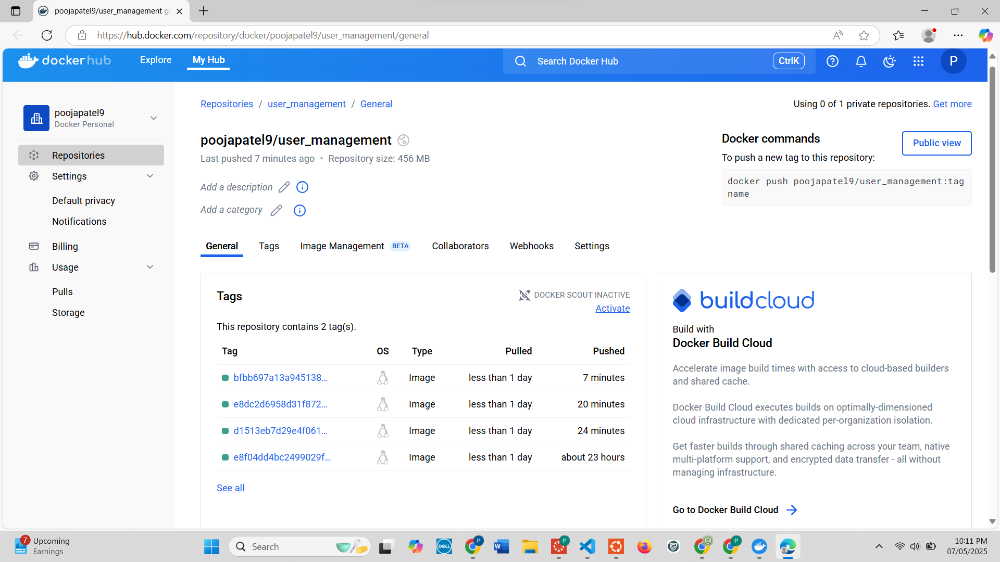

# User Management System — Final Project @ NJIT

Welcome to the **User Management System Final Project** 

---

## Chosen Feature: QR Code Generation User Invites with MinIO

### Feature Description:
This feature allows registered users to invite others via email using a base64-encoded QR code. Each QR code encodes a unique reference string to identify the inviter, track successful invitations, and redirect the invitee upon acceptance.

### Key Capabilities:
- Invite users via the `/invite` endpoint by entering their email.
- Generate a base64-encoded QR code for each invitation.
- Store QR codes in **MinIO** via Docker.
- Track invite statuses (`pending`, `accepted`) in a dedicated database table.
- Accept invites via `/invite/accept?ref=...`, which marks them as used.
- View invite statistics through `/me/invites`.
- Administer invitations via a complete BREAD HATEOS-style API.

---

## QA Issues Resolved

| Issue # | Title |
|--------|-------|
| [#1](https://github.com/PoojaPatel9/user_management/issues/1) | Email verification email was not being sent after registration |
| [#5](https://github.com/PoojaPatel9/user_management/issues/5) | Swagger UI not showing token input box for OAuth2PasswordBearer |
| [#6](https://github.com/PoojaPatel9/user_management/issues/6) | MinIO Service Connection Failure in GitHub Actions During CI/CD |
| [#7](https://github.com/PoojaPatel9/user_management/issues/7) | Missing Test Coverage for Invite API Routes (`/invite`, `/invite/accept`, `/me/invites`) |
| [#8](https://github.com/PoojaPatel9/user_management/issues/8) | Missing Business Rule Validation in `invite_service.py` |

---

## Test Coverage Improvements

I added **10+ tests** to ensure the invite functionality works reliably:
- Invite creation with a valid email
- Self-invites are rejected (`400 Bad Request`)
- Duplicate invites are blocked (`409 Conflict`)
- Invalid email formats return `422 Unprocessable Entity`
- Invite acceptance updates the status correctly
- Invite statistics return accurate counts

All tests use `pytest`, `httpx.AsyncClient`, and FastAPI dependency overrides for isolation and realism.

---

## Business Logic Validations

Validation logic was added to `invite_service.py` to ensure:
- Users **cannot invite themselves**
- Duplicate pending invites are **not allowed**
- Only pending invites can be accepted

These validations maintain system integrity, prevent misuse, and ensure a secure invite flow.

---

## CI/CD + DockerHub

- Configured GitHub Actions pipeline with PostgreSQL and MinIO service containers
- Fixed MinIO startup timing using Docker's `sleep` and MinIO CLI (`mc`)
- Successfully builds and pushes Docker image to DockerHub

**DockerHub Repository**: [poojapatel9/user_management](https://hub.docker.com/repository/docker/poojapatel9/user_management)

## DockerHub Screenshot




---

## Reflection

Working on this final project helped me grow as a software developer. I learned how to debug real-world CI/CD pipeline issues, enforce backend business logic, and apply thorough test coverage. Implementing QR code-based invites also taught me how to integrate storage services like MinIO, and reinforced the importance of robust API design, validation, and testing practices in modern software engineering.

---

## Getting Started

```bash
# Clone the project
git clone https://github.com/PoojaPatel9/user_management.git
cd user_management

# Start the system using Docker
docker compose up --build
